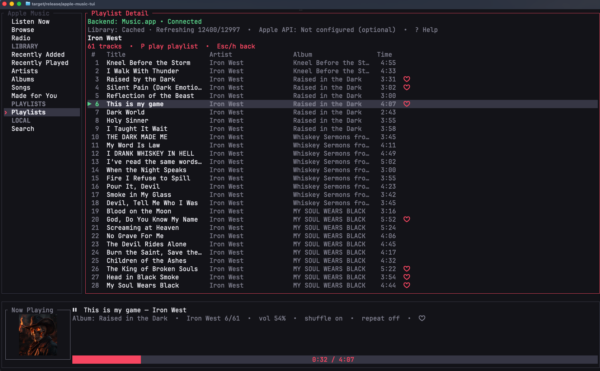
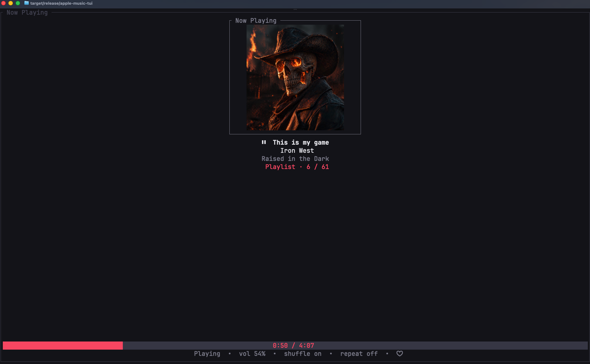

# apple-music-tui

`apple-music-tui` is a keyboard-first terminal interface for Apple Music
on macOS.

Built with Rust and Ratatui, it provides a local-first Apple Music
client using Music.app automation without requiring an Apple Developer
Program membership.



## Features

- Native Music.app playback
- Local Apple Music library browsing
- Terminal album artwork
- Full-screen Now Playing
- Session-based shuffle
- Search, sorting and filtering
- Playlist and album playback
- Keyboard-driven workflow
- Homebrew installation

Music.app remains the audio engine. The application does not decode or
stream Apple Music audio itself.

## Installation

### Homebrew (recommended)

```bash
brew install dmshvedchenko/tap/apple-music-tui
```

Run:

```bash
apple-music-tui --backend macos
```

### From source

Requirements: - macOS - Rust stable 1.88+ - Music.app installed

```bash
cargo install --path .
apple-music-tui --backend macos
```

## Screenshots

### Playlist browsing and playback


### Full-screen Now Playing



## Local Music.app backend

The macOS backend provides a local-first Apple Music experience without
paid Apple Developer Program membership.

Supported: - playlists and playlist folders; - local library Songs; -
derived Artists and Albums; - local Recently Added and Recently
Played; - search; - artwork; - exact track playback; - playlist and
album playback sessions.

Music.app remains authoritative for playback state and audio output.

## Cache and refresh

After the first scan, metadata cache allows faster startup.

Refresh manually with:

```text
R
```

Inspect or clear metadata cache:

```bash
apple-music-tui cache-status
apple-music-tui cache-clear
```

## Keyboard shortcuts

Key Action

---

`j/k` Navigate
`Enter` Open or play
`P` Play playlist/album
`N` Full-screen Now Playing
`n/p` Next/previous track
`Space` Play/pause
`s` Shuffle
`R` Refresh
`/` Search
`S` Sort
`F` Filter
`?` Help
`q` Quit

## Development

```bash
cargo fmt --check
cargo clippy --all-targets --all-features -- -D warnings
cargo test
cargo build --release
```

## Repository

https://github.com/dmshvedchenko/apple-music-tui

## License

MIT License.
